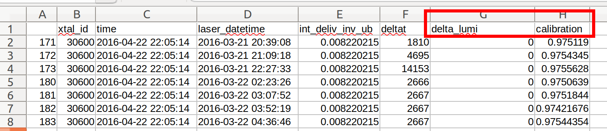

# Data Preprocessing

## Overview

This folder contains ECAL datasets, named as **df_skimmed_xtal_$ID_$year.csv**. For example, “df_skimmed_xtal_30600_2016.csv” means
the dataset for Crystal with ID 30600 and Year 2016. A screenshot is shown below. Basically, we only
use the last two columns in this project: the delta_lumi (the luminosity difference) and the calibration.

## The Dataset 

The data is provided for all 75848 crystals starting from 2016 through 2018. It includes the following columns.

- **xtal_id**: Crystal Identification number within ECAL ranging from [0, 75848].

- **start_ts**: Start of interval of validity (IOV).

- **stop_ts**: End of IOV.

- **laser_datetime**: Timestamp of the measurement for a given crystal within an IOV.

- **calibration**: APD/PD ratio taken at laser_datetime.

- **time**: Time corresponding to the luminosity measurement (obtained from BRIL) closest to the laser_datetime.

- **int_deliv_inv_ub**: Approximate integrated luminosity delivered up to the measurement in the units of micro barn inverse.

## The Problems

The crystal response in the detector is complex and non-linear over a period of time. There are 10,000 calibrations available for each crystal during each years during Run II. Hence, in total, there are 2 B data points available for the analysis. We want to develop an algorithm to predict the response of the ECAL crystals in a given region at a given luminosity. The problem can be divided into three sub-parts:

- During a running period the collisions the crystals are irradiated with a constantly. Given a history of several run during a year, what is the response of the detector during the next run? What is the accuracy of the predictions? Is it possible to accurately setup the trigger thresholds for a given run?

- At the end of each year, known as Year End Technical Stop (YETS), the LHC halts operation for several weeks. The transparancy of the crystal recovers during this period. Can the same models be trained also predict the recovery of the crystals during YETS?

- Each Run of the LHC is followed by longer stops known as Long Shutdowns, which last for roughly two years. Can these models be scaled to make predictions from Run to Run?

- During the High Luminosity Phase the luminosity of the LHC will increase roughly 3.5 folds. Will the crystals be able to remain functional during HL-LHC?