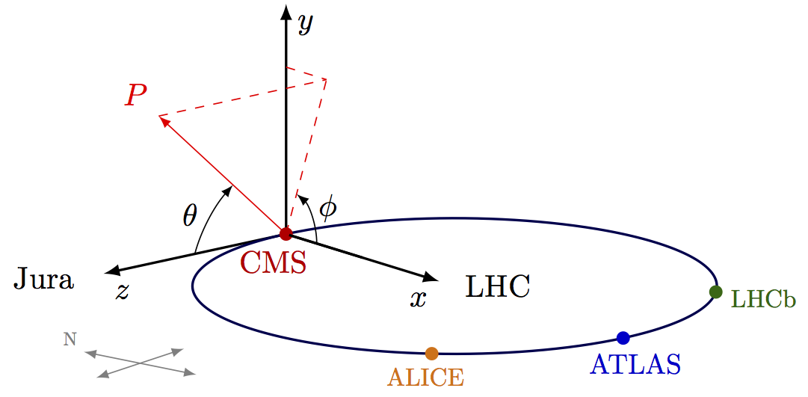
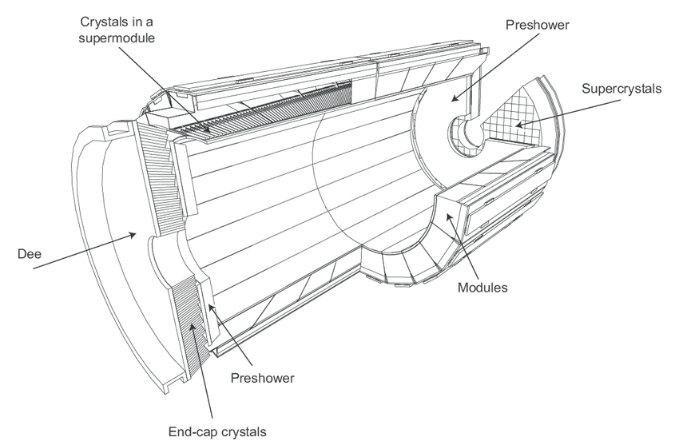
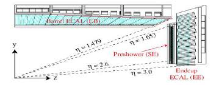
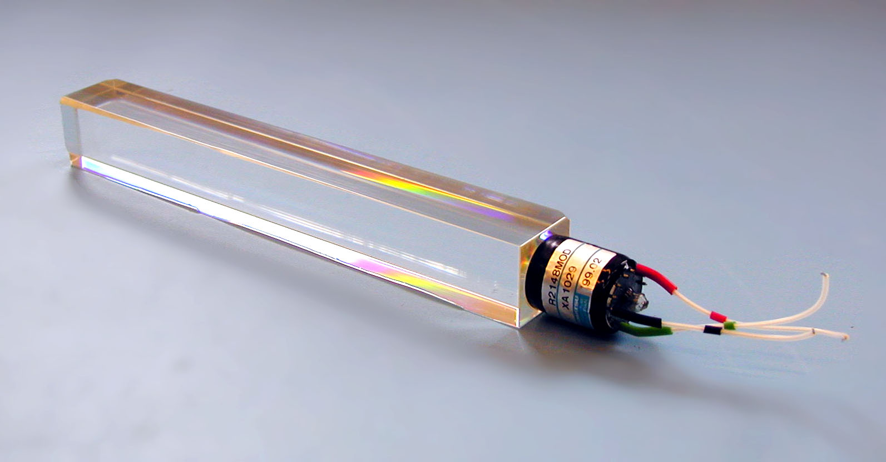
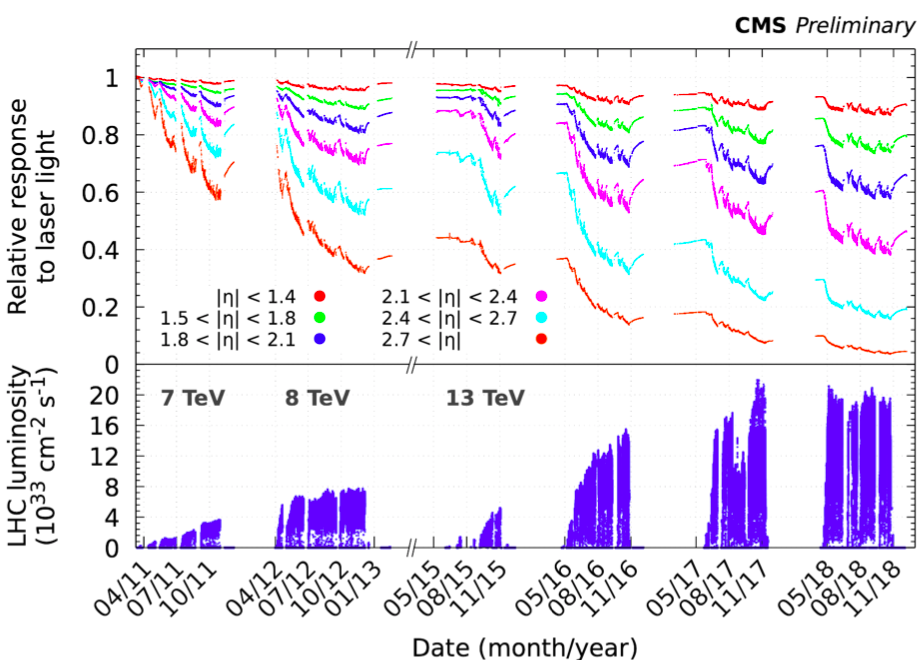
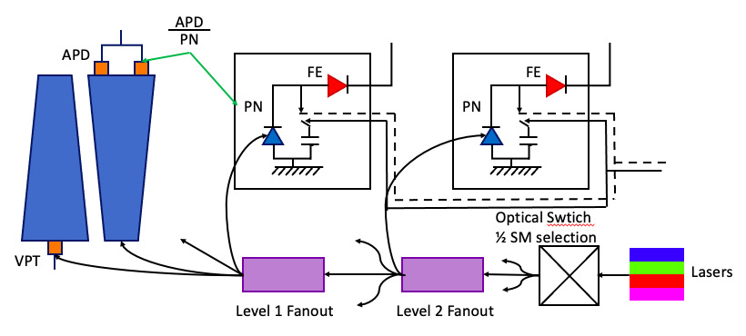
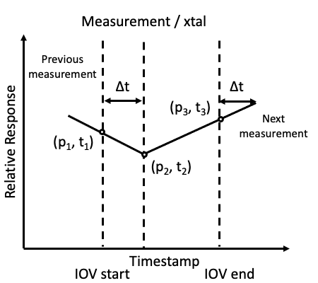

*******************
Project Description
*******************

Introduction
================

The Compact Muon Solenoid (CMS) detector is a general purpose detector designed to detect particles produced in the proton-proton collisions. The proton beams are provided by the Large Hadron Collider (LHC) and the collision occur at a center-of-mass energy as high as :math:`\sqrt{s}=14` TeV. The CMS detector is 21.6 m in length, has a radius of 7.5 m and weighs around 14,600 T. It consists of several layers of sub-detectors modules, each module designed to perform specific measurement. The inner most layer consists of tracker- pixels and silicon strips. The next two layers are the Calorimeters- electromagnetic (ECAL) and hadronic (HCAL). These layers are embedded within a solenoid capable of generating a magnetic field of 3.8 T. The outermost layers are the Muon systems, which consists of several layers of gas detectors. The information from all the sub-detectors is used for particle identification and measurement of their physical properties. The calorimeters play a vital role in the measurement of the energies of the particles produced in the collisions such as electrons, photons and hadrons. Neutrinos produced during the collisions travel through the entire assembly without being detected. The presence of neutrinos can be characterized by missing component of the energy in transverse direction, called Missing Transverse Energy (MET). The calorimeters provide a hermatic coverage for the measurement of MET. 

.. image:: images/cms_experiment.png
   :width: 400
   :align: center

.. centered::
	*An overview of the CMS detector. The figure shows the arrangement of different sub-detector components inside the assembly.*

The CMS Coordinate System
-----------------------------

The point of collision is considered to be the center of the coordinate system. The Y axis points vertically upward whereas the X axis points to the center of the LHC ring and the Z axis points along the direction of the beam. For practical purposes, it is useful to use the radial coordinates R. radial distance from the beam line, :math:`\theta`, the polar angle with respect to the Z axis and :math:`\phi`, the azimuthal angle. Particles produced in the collisions tend to be boosted along the Z direction. Hence, one can define rapidity y as:

.. math::
	
	y = \dfrac{1}{2}\ln{\bigg{(}\dfrac{E+p_{z}c}{E-p_{z}c}\bigg{)}}

Where E is the energy of the particle and pz is the component of the particle momentum along the z axis.The advantage of using rapidity instead of the polar angle is that the rapidity differences are invariant under the boost along the Z axis. In the ultra relativistic limit, the rapidity of the particle can be approximated to pseudo rapidity :math:`\eta`

.. math::
	
	\eta = -\ln{\tan{\bigg{(}\dfrac{\theta}{2}\bigg{)}}}

The pseudorapidity doesn’t require precise measurement of either E or the momentum as opposed to the rapidity. Hence, the four momentum of the particle can be defined 

.. math::
	
	(E,p_{x},p_{y},p_{z}) = (m_{T}\cosh{\eta}, p_{T}\cos{\phi}, p_{T}\sin{\phi}, m_{T}\sinh{\eta})

Where the transverse mass mT is defined as :math:`\sqrt{p_{T}^2+m^2}`` and :math:`p_{T}=\sqrt{p_{x}^2+p_{y}^2}`

.. centered::
	*The CMS coordinate system*

Luminosity
-----------------------------

Luminosity is defined as the rate of particles passing through a cross section area. In the context of the LHC, the luminosity, also known and instantaneous luminosity, is given by

.. math::
	
	\mathcal{L} = \dfrac{N_{1}N_{2}fN_{b}}{4\pi\sigma_{x}\sigma_{y}}

Where :math:`N_{1}` and :math:`N_{2}` are the number of particles per bunches, f is the revolution frequency and :math:`N_{b}` is the number of bunches in the ring. The sizeof the bunches along x and y can be characterized by the standard deviation of the gaussian distribution of their positions- :math:`\sigma_{x}` and :math:`\sigma_{y}` respectively. One can define integrated luminosity as the integral of instantaneous luminosity over a given period of time:

.. math::
	
	L = \int_{0}^{T}\mathcal{L}dt

Hence for a given physical process, the number of its occurrences in the proton-proton collision can be given by

.. math::
	
	N_{events} = L\sigma

Where :math:`\sigma` is the cross section of the physics process.

The luminosity at the CMS is calibrated using separation scans called "van der Meer scans" which allow for determination of the absolute luminosity as a function of beam parameters which in turn allows for the calibration of the individual luminometers. These scans are performed once per calibration system and year, and the correction factors and uncertainties corresponding to the luminosity measurements are calculated for every year.

The LHC was designed to operate at a center-of-mass energy of 14 TeV energy with an instantaneous luminosity peaking at :math:`10^{34}` cm :math:`^{-2}`s :math:`^{-1}`. During the Run II era, the maximum luminosity recorded was :math:`2.06\times10^{34}` at 13 TeV.

A LHC beam consists of around 2500 bunches of protons, each bunch containing ~O(:math:`10^11`) protons at an energy of 6.5 TeV [6]. Two beam circulating in opposite directions cross at various interaction points around the LHC- one of them being at the site of the CMS detector. A CMS event corresponds to the data recorded in crossing of one bunch. A luminosity block corresponds to the a collection of temporarily consecutive events, which is roughly 22 s. A CMS Run consists of a collection of several luminosity blocks. The instantaneous luminosity peaks at one point during the LHC beam cycle and gradually decreases with an exponential trend until the cycle ends. A CMS Runs starts and ends during such LHC cycle and typically lasts for several hours. 

Electromagnetic Calorimeter (ECAL)
================================================

The ECAL is a high granularity, high resolution scintillation crystal calorimeter designed for the measurement of energies of photons and electrons produced in the collisions. The resolution of this measurements is crucial for several physics analysis. Higgs boson decaying to two photons [5] in the final state is the most sensitive channel for the mass measurement of Higgs boson. The width of the mass peak for this analysis is dominated by the instrumental resolution. Hence, in order to have accurate measurements of energies, it is imperative to have a detector with fine resolution and robust system for measurement of detector conditions that allows for effective calibration of the detector response.

.. centered::
	*A 3D view of the CMS ECAL.*

.. centered::
	*A layout of the ECAL (quandrant view).*

ECAL Geometry
-----------------------------

The ECAL [1] is a hermetic calorimeter made of 75848 lead tungstate (:math:`\text{PbWO}_4`) scintillating crystals. It is divided into two regions- barrel (EB), covering pseudorapidity region :math:`|\eta\le1.48|` and endcap (EE), covering the pseudorapidity region :math:`1.48\ge|\eta|\le3`. It also includes a pre-shower detector, in the forward region (:math:`1.65\ge|\eta|\le2.6`), made of lead absorber and silicon strip sensors. The EB contains 61,200 crystals in total, grouped into 36 super module, each containing 1,700 crystals. Whereas EE contains 14,648 crystal arranged in 4 \textit{dees}. A group of 5x5 crystals in EE is collectively known as a super-cluster. EB consists of 23 cm long crystals with front face cross section of 2.2 cm x 2.2 cm, whereas EE uses 22 cm long crystals with front face cross sections of around 2.86 cm x 2.86 cm. The crystals have truncated pyramidal and are assembled inside the ECAL to minimize the inter-crystal gaps aligned with the trajectories of the particles emanating from the collisions. The ES has two planes of silicon strips- the first one vertically aligned and the second one is horizontal. EB employs Avalanche Photodiodes (APDs) [2] while EE uses vacuum photodiodes (VPTs) [3]. The density of the crystals (8.28 f/:math:`cm^3`) correspond to a radiation length of ( :math:`\text{X}_0` =0.89 cm).

The crystals absorb the photons and electrons during the collision. The direction of the photons and electrons can be determined by measuring the energy deposits in the individual crystals. The ES identifies single photons from the neutral hadrons such as :math:`\pi^0` decaying into a pair of collimated photons.

ECAL Crystals
-----------------------------

.. centered::
	*A photograph of an* :math:`\text{PbWO}_4` *crystal.*

The energy resolution of the ECAL can be parameterized the following expression

.. math::
	
	\dfrac{\sigma_{E}}{E}=\dfrac{S\%}{\sqrt{E}}\oplus\dfrac{N\%}{E}\oplus C\%

where the first term on the left hand side, the \textit{stochastic} term, is the contribution from the statistical fluctuations in light efficiency, second term is the contribution from the electronic noise and the last term is a constant that accounts for operational effects. The parameters S, N and C are subject to variations in different regions of the detector and with changes in luminosity. The parameters have been measured using test beam studies on ECAL. For electrons with :math:`p_{T}` larger than 10 GeV, the energy resolution is betten than 1\%. 

The radiations cause damage to the crystal leading to reduced transparency over time. The damage is recovered in the absence of the radiation, but takes about a week for the full recovery of the crystal. Hence, a transparency monitoring system is set up to correct for the crystal response from radiation damage. The radiation damage also depends on the location of the crystal within the detector. The higher :math:`\eta` corresponds to the forward region, which receives a larger dose of radiations as compared to the crystal with :math:`\eta=0`, i.e. Barrel region. Hence, the forward crystals tend to have a lesser transparency than the central crystals\ref{fig:crystal_transparency_runII}.

.. centered::
	*Relative response of crystal to laser light in different* :math:`\eta` *regions, corresponding to different detector regions. While the crystals in EB have a consist response above 80\% throughout Run II, the crystals in EE show a large degradation in response at the end of Run II.*

ECAL Transparency Monitoring
-----------------------------

The transparency monitoring system [4] consists of lasers set up at one end of the crystals and silicon photodiodes (PN) at the other end. The system is capable of precisely and continuously measuring the crystal response during running to determine the changes in its transparency. Two lasers are used, both manufactured by Quantronix (Nd:YLF 527DQ-S Q-switched and Ti:Sapphire), to provide sources of two different  wavelengths. 
\par
The offline corrections are implemented from the measurement of the channel responses. In the barrel region, we use APD/PN (Avalanche Photodiode to PN transistor) and in the endcap region we have VPT/PN ratio (Vacuum Phototubes). The response measurements are taken every 45 minutes
Three data points (p1, p2, p3) are measured and the response is interpolated to correct the events in between the times. The measurements are taken in the 3 :math:`\mu` s LHC gap window to avoid interference with the LHC system. The information is inserted in Online Master Database System (OMDS) so that it can be propagated to offline DB for prompt reconstruction. Each set of data is available for a specific Interval of Validity (IOV). Each IOV contains one and only one response number per crystal, for all ECAL crystals called a sequence\ref{fig:ecal_iov_measurement}. In total, each IOV contains 75848 measurements corresponding to all the ECAL crystals. The response variation between two measurements is approximated by linear extrapolation. 

.. centered::
	*A schematic depicting the ECAL Laser Monitoring System at CMS.*

.. centered::
	*Example of a measurement per crystal within as sequence.*

Problem Statement
=====================

The crystal response in the detector is complex and non-linear over a period of time. There are 10,000 calibrations available for each crystal during each years during Run II. Hence, in total, there are 2 B data points available for the analysis. We want to develop an algorithm to predict the response of the ECAL crystals in a given region at a given luminosity. The problem can be divided into three sub-parts:

    #.  During a running period the collisions the crystals are irradiated with a constantly. Given a history of several run during a year, what is the response of the detector during the next run? What is the accuracy of the predictions? Is it possible to accurately setup the trigger thresholds for a given run?

    #.  At the end of each year, known as Year End Technical Stop (YETS), the LHC halts operation for several weeks. The transparancy of the crystal recovers during this period. Can the same models be trained also predict the recovery of the crystals during YETS?

    #.  Each Run of the LHC is followed by longer stops known as Long Shutdowns, which last for roughly two years. Can these models be scaled to make predictions from Run to Run?

    #.  During the High Luminosity Phase the luminosity of the LHC will increase roughly 3.5 folds. Will the crystals be able to remain functional during HL-LHC?

Description of Data
-----------------------

The data is provided for all 75848 crystals starting from 2016 through 2018. It includes the following columns.

    #.  **xtal\_id**: Crystal Identification number within ECAL ranging from [0, 75848].
    #.  **start\_ts**: Start of interval of validity (IOV).
    #.  **stop\_ts**: End of IOV.
    #.  **laser\_datetime**: Timestamp of the measurement for a given crystal within an IOV.
    #.  **calibration**: APD/PD ratio taken at laser\_datetime.
    #.  **time**: Time corresponding to the luminosity measurement (obtained from BRIL) closest to the laser\_datetime.
    #.  **int\_deliv\_inv\_ub**: Approximate integrated luminosity delivered up to the measurement in the units of micro barn inverse.

References
============

*[1] The CMS electromagnetic calorimeter project: Technical Design Report. Technical design report. CMS. Geneva: CERN, 1997. url: https://cds.cern.ch/record/349375.*

*[2] B Patel et al. “Avalanche photodiodes for the CMS electromagnetic calorimeter”. In: CERN-CDS (1999). doi: 10.5170/CERN-1999-009.203. url: https://cds.cern.ch/record/548118.*

*[3] P. R. Hobson. “Avalanche photodiodes and vacuum phototriodes for the electromagnetic calorimeter of the CMS experiment at the Large Hadron Collider”. In: Nucl. Instrum. Meth. A 604 (2009). Ed. by Richard Bates et al., pp. 193–195. doi: 10.1016/j.nima.2009.01.089.*

*[4] Federico Ferri. “Monitoring the stability of the CMS electromagnetic calorimeter”. In: 293 (Apr. 2011), p.012051. doi:10.1088/1742-6596/293/1/012051.url:https://doi.org/10.1088/1742-6596/293/1/012051.*

*[5] A. M. Sirunyan et al. “Measurements of Higgs boson production cross sections and couplings in the diphoton decay channel at* :math:`\sqrt{\mathrm{s}}` *= 13T eV ”. In: Journal of High Energy Physics 2021.7 (July 2021), p. 27. issn: 1029-8479. doi: 10.1007/JHEP07(2021)027. url: https://doi.org/10.1007/JHEP07(2021)027.*

*[6] LHC Report. https://home.cern/news/news/accelerators/lhc-report-full-house-lhc.*

